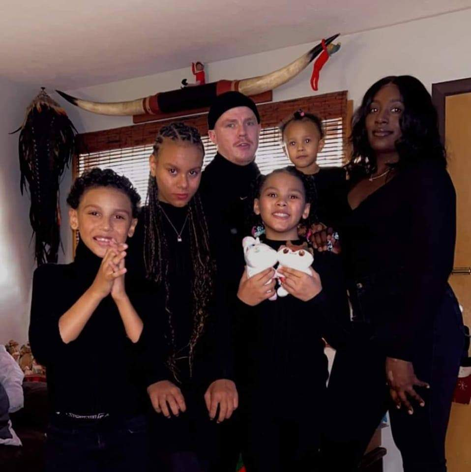

# Hi, I’m Robert Wyman 

## About Me
I’m currently studying web development and programming, working with **HTML, CSS, JavaScript, Java, and C++**.  
After graduation, I hope to become a **software developer** and eventually branch into **app development**.  

## What I’m Working On
- 📚 Learning advanced JavaScript  
- 🎮 Creating YouTube content and gaming events for adults  
- ✉️ 9 years of experience as a mail carrier, now transitioning into tech  

## My Skills
- HTML, CSS, JavaScript  
- C++ (OOP, STL, memory management)  
- Java (multithreading, JavaFX)  
- Git & GitHub for version control  

## Hobbies
🏋️‍♂️ Fitness • 🎮 Gaming • 🎨 Creative projects • 👨‍👩‍👧 Family time  

## Connect with Me
- [LinkedIn](https://www.linkedin.com/in/robert-wyman-6ba52a233/)  
  

